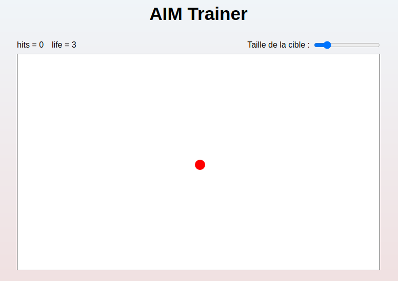

# AIM Trainer

Ce site à été réalisé uniquement en HTML, CSS et JavaScript.

Le but du jeu est d'améliorer sa visée dans les jeu de tirs.
Pour ce faire, il vous surfit de cliquer sur la cible. Mais ce n'est pas si simple, la cible change de position à chaque clique. 
Si vous cliquez à un autre endroit que sur la cible, vous perdez une vie.

#### /!\ Attention, vous n'avez que 3 vies !

Vous pouvez accéder au rendu du site en [cliquant ici](https://guillaumepirard.github.io/aim_trainer/ "Rendu du site").

N'hésitez à partager le projet sur Linked-In si vous l'avez aimé ! 

Pour accéder à mon profil Linked-In, [cliquez ici](https://www.linkedin.com/in/guillaume-pirard/ "Mon profil Linked-In") !

